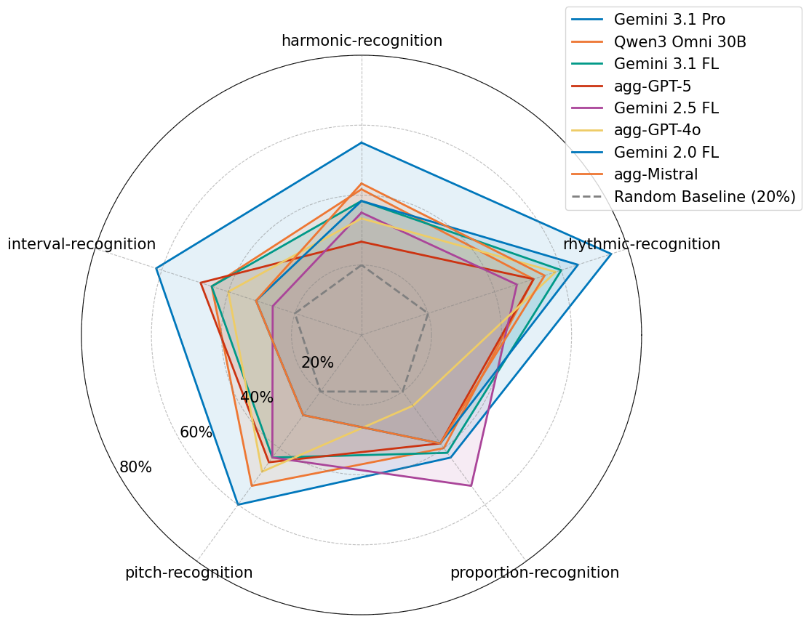

# Music I Care About Meta-Benchmark (MusICA MetaBench) - submitted to ISMIR 2026

A comprehensive benchmark suite for evaluating Multimodal Large Language Models (MLLMs) on music perception tasks across multiple modalities (Audio, Symbolic, and Visual).

> **📄 Paper companion repository.** This repository accompanies the paper *Music I Care About Meta-Benchmark (MusICA MetaBench)*, submitted to ISMIR 2026. It contains the code, data preparation scripts, benchmark instances, inference logs, and results presented in the paper.
> <!-- TODO: add paper link / arXiv URL / DOI and BibTeX citation once available -->


## Overview

This project provides a systematic framework to assess how well MLLMs understand classical music. It generates music theory questions covering pitch, rhythm, and harmony using various modalities:
- **Audio**: WAV files (mastermixes).
- **Symbolic**: MusicXML and ABC notation.
- **Visual**: PNG images of scores.

The benchmark includes a flexible generation pipeline, an inference engine via the OpenRouter API, and a suite of evaluation and aggregation tools.

## Key Features

- **8-Step Generation Pipeline**: Controlled generation of questions, ground truth, and distractors.
- **Multi-Modality**: Support for evaluating models on different representations of the same musical content.
- **NOTA Support**: Includes "None of the above" as a correct answer for ~20% of questions to test for hallucination/over-confidence.
- **Extensible Configuration**: YAML-based setup for benchmarks, evaluations, and music theory ontologies.
- **Statistical Analysis**: Tools for significance testing (pairwise comparison) and aggregate reporting.

## Table of Contents
1. [Setup](#setup)
2. [Quick Start](#quick-start)
3. [Technical Guidelines](#technical-guidelines)
4. [Dataset Information](#dataset-information)
5. [Inference & Parsing](#inference--parsing)
6. [Evaluation & Results](#evaluation--results)
7. [Logs & Reproducibility](#logs--reproducibility)

## Setup

### Prerequisites
Before starting, ensure you have the following installed and configured:
- **Tools**: `ffmpeg`, `pdftoppm`, and **MuseScore**.
- **Display Access**: Required for score rendering (e.g., connect via `ssh -X` or `ssh -Y` if running remotely).
- **MuseScore Configuration**: The path to your MuseScore executable must be correctly set in [src/conversions/musicxml2pdf.py](src/conversions/musicxml2pdf.py) (see `get_musescore_path`).

### Environment
```bash
# Create a virtual environment and install dependencies
bash prepare_venv.sh
```

### API Configuration
Set your OpenRouter API key:
```bash
export OPENROUTER_API_KEY="your-api-key"
```
If not using OpenRouter, you can configure your own API endpoint and environment variable name with the API key in `eval-config.yaml`.

### Data Preparation

#### ChoraleBricks
```bash
# Download ChoraleBricks and process it to the required format
bash prepare_data.sh
```

#### ChoralSynth
```bash
# Checkout to a different branch
git checkout dataset-choralsynth

# Download ChoralSynth and process it to the required format
bash prepare_data_choral_synth.sh
```


## Quick Start

### Step A: Generate a Benchmark
```bash
.venv/bin/python generate_benchmark.py \
    --config benchmark-generation-config.yaml \
    --benchmark_file test_benchmark.tsv \
    --questions_per_subcategory_count 10 
```
*The `questions_per_subcategory_count` parameter specifies questions per category-modality combination.*

### Step B: Run Inference
```bash
.venv/bin/python3 run_benchmark.py \
    --config eval-config.yaml \
    --benchmark_file test_benchmark.tsv \
    --models "openai/gpt-4o"
```
See the logs from the benchmark evaluation in `logs/run_<datetime><other>/logs.tsv`, and the result table in `results/<model>/<benchmark-size>/<setup>`.

## Technical Guidelines (custom datasets/formats/questions)

### Custom Datasets
To apply MusICA MetaBench to a custom dataset:
1. **Dataset Requirements**:
   - **Tonal Dataset**: Otherwise, adjustment of question templates and ground truth extraction methods is needed.
   - **One or more monophonic voices**: For polyphonic instruments (e.g.,piano), adjustments are needed.
   - **Piece-aligned**: The same piece represented simultaneously as audio, sheet music image, and symbolic file.
   - **MusicXML is provided**: The file `symbolic.musicxml` is required for every piece for automatic extraction of the ground truth. Other symbolic formats (MIDI, ABC notation, LilyPond, Humdrum, etc.) may also work but have not been verified and may require adjustments.
2. **Prepare Pieces**: Provide the data in `data/$DATASET/$PIECE_ID/<music-file>.[pdf/wav/png/musicxml/...]`.
3. **Other Modalities**: The pipeline is now configured to receive `symblic.abc.txt` (for symbolic modality), `visual.short.png` (for image modality), and `audio.mastermix.wav` (for audio), which are also the names of submodalities.
4. **Generate List**: Run `bash generate_pieces_list.sh` to obtain the list of pieces, which is required for automatic benchmark generation.
5. **Generate the Benchmark Instance**: 
```bash
.venv/bin/python3 generate_benchmark.py \
    --config benchmark-generation-config.yaml \
    --benchmark_file test_benchmark.tsv \
    --size 10 
```
6. **Potentially, debug the ground truth extraction methods in [ground_truth_and_distractor_pool_extractions.py](src/ground_truth_and_distractor_pool_extractions.py), as their validation was limited to ChoraleBricks and ChoralSynth.

### Custom Formats
To add support for a new musical format (treated as new submodality), e.g. MIDI, different types of images (e.g. for comparing performance on rendered vs. scan vs. handwritten):
1. Update `musical_piece_format_info` in `run_benchmark.py` or your config file to include the new extension and its description. For `run_benchmark.py` to work properly, audio files should be in `WAV` format, images either in `PNG` or `PDF`, and symbolic being a textual file (MIDI needs to be converted e.g. to a CSV before feeding into LLMs), and every submodality name should be in format `<modality><anything>.<file-extension>`
2. Ensure the generation pipeline (`generate_benchmark.py`) is aware of the new submodality by adding it to the `benchmark-generation-config.yaml`.

### New Question Templates
You may define your own questions:
1. **Define Meta-Question**: Provide the questions in [meta-questions.tsv](meta-questions.tsv) file (see example for the format).
2. **Implement Extraction**: Implement a python method inside [src/ground_truth_and_distractor_pool_extractions.py](src/ground_truth_and_distractor_pool_extractions.py) that automatically extracts the ground truth for a given musicxml file. For the method signature, check the existing functions (linked from `meta-questions.tsv`).
3. **Link Method**: Link the implemented method from the [meta-questions.tsv](meta-questions.tsv) file.
4. **Ontology**: If needed, update [ontology.yaml](ontology.yaml) to include new musical concepts, and debug.

## Dataset Information

### ChoraleBricks
- **Benchmark Instance:** [seed_52.tsv](benchmarks/qs_per_subcat_20/seed_52.tsv) (the one used as the one instance in the experiments)

### ChoralSynth
- **Benchmark Instance:** [choralsynth.size20.seed_52.tsv](benchmarks/choralsynth.size20.seed_52.tsv) (the one used as the one instance in the experiments)

## Inference & Parsing

### User Prompt Template
The prompt template defines how the question and musical context are presented to the LLM. It can be customized in [eval-config.yaml](eval-config.yaml).
- **Template Variable:** `user_prompt_template`
- **Placeholder Replacement:** `<FORMAT>`, `<QUESTION>`, `<OPTIONS_TEXT>`, and `<OPTION_LABELS>` are dynamically replaced during runtime.

### Response Parsing
Responses are parsed to extract the final letter choice. The logic is:
1. **Extraction**: `run_benchmark.py` uses methods loaded from `src/extraction_methods.py` (configured via `path_to_extraction_file`). The methods used now are in `src/mmmu_eval_utils` (adapted from MMMU benchmark).
2. **Format**: The model is instructed to end with `Final Answer: <answer>`.
3. **Regex**: A regex typically searches for the last occurrence of a single letter enclosed in parentheses or following "Final Answer:".

## Evaluation & Results

### Per-Category Analysis


Results, Chorale-bricks, s=300 (20 questions per modality-category pair), one benchmark instance, comparison across categories. Axes for accuracy end at 80%.

### Technical Setup of Running LLMs

- **Environment:** Tested on Linux (Ubuntu 22.04) using Python 3.10+.
- **LLM API & Infrastructure:**
  - **OpenRouter API:** Most models are accessed via a unified [OpenRouter API](https://openrouter.ai/).
  - **Local Deployment:** Qwen-3-omni (specifically `Qwen3-Omni-30B-A3B-Thinking`, full precision) is run locally using [vLLM](https://docs.vllm.ai/) on an NVIDIA GH200 superchip (144GB GPU VRAM).
- **Data Privacy & Leakage Prevention:**
  - **Leakage Prevention:** Use of endpoints that may train on inputs is disabled.
  - **Zero Data Retention (ZDR):** Enabled via [OpenRouter ZDR](https://openrouter.ai/docs/guides/features/zdr) where available (note: this was not available for GPT-family audio models).
- **Inference Configuration:**
  - **Data Encoding:** Symbolic musical files are sent as raw text; audio and image files are sent using Base64 encoding.
  - **Parameters:** Models use default parameters to reflect real-world usage, with the exception of the random seed.
  - **Reproducibility:** A pseudo-random seed is generated for each inference call to ensure better reproducibility (successfully achieved for local Qwen-3-omni, though limited for OpenRouter endpoints). We use distributed seeds rather than a single fixed seed to evaluate the model as a distribution rather than a single fixed instance.


### LLM Inference Logs
Full logs of the inference (prompts and raw JSON responses, parsed and evaluated responses) are provided for the best-performing model, Gemini 3.1 Pro Preview: 
- [Link to Logs Directory](logs/run_2026-04-19_210028_normal-google_gemini-3.1-pro-preview-20-52/logs.tsv) 

### Reproducing Results
... <!-- TODO: Instructions for reproducing paper results -->

## Project Structure
| Path | Description |
| :--- | :--- |
| `benchmarks/` | Pre-generated and custom benchmark TSV files. |
| `data/` | Source musical pieces (ChoraleBricks, Vienna piano corpus, etc.). |
| `src/` | Core logic for ground truth extraction and distractor generation. |
| `results/` |  Detailed results for all models, for multiple benchmark sizes and benchmark instances. |
| `aggregated/` | Processed results and significance tests. |
| `tables/` | LaTeX and TSV tables for paper results. |
| `aggregated/results-for-paper/` | The visualization and selected results for paper. |

## Authors

- **Tomáš Sourada** — [ÚFAL CUNI], [Prague, Czech Republic] · [ORCID](https://orcid.org/0009-0003-6792-825X)
- **Katia Vendrame** — [FIT VUT], [Brno, Czech Republic] · [ORCID](https://orcid.org/0009-0009-1659-0459)
- **Jan Hajič, jr.** — [ÚFAL CUNI], [Prague, Czech Republic] · [ORCID](https://orcid.org/0000-0002-9207-567X)

**Corresponding author:** Tomáš Sourada — [sourada@ufal.mff.cuni.cz](mailto:sourada@ufal.mff.cuni.cz)


## Citation

If you use this benchmark or code, please cite our paper:

TBA

<!-- TODO: replace with final BibTeX entry once the paper is published -->
<!--```bibtex
@inproceedings{musica-metabench-2026,
  title     = {Music I Care About Meta-Benchmark (MusICA MetaBench)},
  author    = {TODO},
  booktitle = {Proceedings of the International Society for Music Information Retrieval Conference (ISMIR)},
  year      = {2026},
  note      = {Submitted}
}
``` -->

## License

This repository combines original material by the authors with data derived from third-party datasets, so different parts carry different licenses. Please respect the license that applies to whatever you reuse.

| Component | License | Full text |
| :--- | :--- | :--- |
| Source code (all `.py` / `.sh` scripts) and original, non-derived data/config (`ontology.yaml`, `meta-questions.tsv`, `pieces.tsv`, `selected_cadences.yaml`, `all_pox_cadence_types.yaml`, `eval-config.yaml`, `benchmark-generation-config.yaml`) | **GPL-3.0-or-later** | [LICENSE](LICENSE) / [LICENSE-SOURCE-CODE](LICENSE-SOURCE-CODE) |
| Benchmark data **derived from ChoraleBricks** (e.g. `benchmarks/qs_per_subcat_20/seed_52.tsv`) | **CC BY 4.0** | [LICENSE-DATA-CHORALEBRICKS](LICENSE-DATA-CHORALEBRICKS) |
| Benchmark data **derived from ChoralSynth** (`benchmarks/choralsynth.*.tsv` and the `dataset-choralsynth` branch) | **CC BY-SA 4.0** | [LICENSE-DATA-CHORALSYNTH](LICENSE-DATA-CHORALSYNTH) |
| `src/mmmu_eval_utils.py` (modified copy of one file from the MMMU-Benchmark project) | **Apache 2.0**, redistributed as part of the GPL-covered source per Apache-2.0 §4 | [LICENSE-THIRD-PARTY-MMMU](LICENSE-THIRD-PARTY-MMMU); see file header for attribution and the list of changes |
| `results/`, `aggregated/`, `benchmark-comparisons/`, `logs/` (raw and aggregated model outputs, inference logs) | Not separately licensed — provided as-is for reproducibility | — |

Most source files carry a short header identifying them as GPL-3.0-or-later; `meta-questions.tsv` and `pieces.tsv` are GPL-covered too but don't carry an inline header, since prepending a comment line would break the TSV parsing that reads them — their license is documented here instead.

**Why GPL for code but CC for data:** GPL is designed for software; it doesn't fit non-code creative/data works well, so the two ChoraleBricks/ChoralSynth-derived benchmark data licenses follow the upstream datasets' own terms instead of the code's license.

**Why two data licenses:** ChoraleBricks is licensed CC BY 4.0, so instances derived from it stay CC BY 4.0. ChoralSynth is licensed CC BY-SA 4.0, and the **ShareAlike** term is contagious — any material derived from ChoralSynth, including these benchmark instances, must remain under CC BY-SA 4.0 with attribution to ChoralSynth.

**How derived data is delineated:** benchmark instances built from ChoralSynth are named with a `choralsynth` prefix (and the ChoralSynth source pieces live on the `dataset-choralsynth` branch); all other benchmark instances are built from ChoraleBricks. See [benchmarks/README.md](benchmarks/README.md) for the per-file breakdown. When in doubt, treat any `choralsynth*` file as **CC BY-SA 4.0**.

**Outputs are not separately licensed.** `results/`, `aggregated/`, and `benchmark-comparisons/` contain raw and aggregated model outputs (inference results, evaluation tables, comparison files) generated by running the GPL-licensed scripts over the benchmark data; they're kept in the repository for reproducibility but are not themselves assigned a license. `logs/` (mostly gitignored) is the same.

**Source data is not redistributed here.** The `data/` directory does not ship any source material from these datasets; the original audio/scores are downloaded on demand by the setup scripts (`prepare_data.sh`, `prepare_data_choral_synth.sh`) directly from their original sources. Only *derived* benchmark instances (TSV question files) are stored in this repository.

### Dataset attributions

If you use the derived benchmark data, you must also credit the upstream datasets:

```bibtex
@dataset{narang_2023_10161065,
  author       = {Narang, Jyoti and
                  De la Vega, Viviana and
                  Lizarraga, Xavier and
                  Mayor, Oscar and
                  Parra, Hector and
                  Janer, Jordi and
                  Serra, Xavier},
  title        = {ChoralSynth: Synthetic Dataset of Choral Singing},
  month        = nov,
  year         = 2023,
  publisher    = {Zenodo},
  doi          = {10.5281/zenodo.10161065},
  url          = {https://doi.org/10.5281/zenodo.10161065},
}

@dataset{balke_2025_15081741,
  author       = {Balke, Stefan and
                  Berndt, Axel and
                  Mueller, Meinard},
  title        = {ChoraleBricks: A Modular Multitrack Dataset for
                   Wind Music Research
                  },
  month        = mar,
  year         = 2025,
  publisher    = {Zenodo},
  version      = {1.0.0},
  doi          = {10.5281/zenodo.15081741},
  url          = {https://doi.org/10.5281/zenodo.15081741},
}
```

